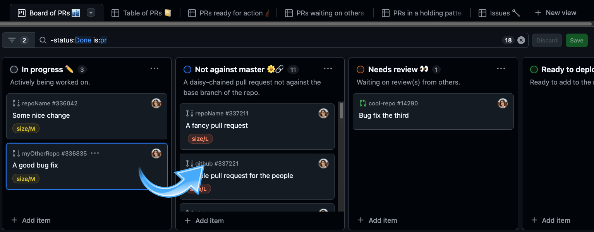

# project-pull-mover

Script to change the status of a pull request in a GitHub project. On macOS, when the script is run and any pull
requests have their project status changed, a desktop notification will appear with the count of how many PRs were
moved.



The script gets the list of pull requests in the specified project, iterates through them, and updates the status field you specify based on the PR's state.

## How to use

### Prerequisites

Install the [`gh` command line tool](https://cli.github.com/). `gh` will be used to authenticate with the GitHub API.
You'll also need [Ruby](https://www.ruby-lang.org/en/documentation/installation/) installed; I built this script
with Ruby version 2.7.1p83.

In [GraphiQL](https://docs.github.com/en/graphql/overview/explorer), run a GraphQL query like this one to get IDs for the options in your project's "Status"-like column:

```graphql
query {
  organization(login: "yourOrg") {
    projectV2(number: 123) { # e.g., https://github.com/orgs/yourOrg/projects/123
      field(name: "Status") { ... on ProjectV2SingleSelectField { options { name id } } }
    }
  }
}
```

You'll use the option IDs from the GraphQL query to tell project_pull_mover where to move your pull requests in your
project.

### Installation

Download the .gem file from the [latest release](https://github.com/cheshire137/project-pull-mover/releases/latest).
Install it via:

```sh
gem install project_pull_mover.gem
```

There should now be a `project_pull_mover` executable in your path.

### Options

```sh
Usage: project_pull_mover [options]
    -p, --project-number NUM         Project number (required), e.g., 123 for https://github.com/orgs/someorg/projects/123
    -o, --project-owner OWNER        Project owner login (required), e.g., someorg for https://github.com/orgs/someorg/projects/123
    -t, --project-owner-type TYPE    Project owner type (required), either 'user' or 'organization'
    -s, --status-field STATUS        Status field name (required), name of a single-select field in the project
    -i, --in-progress ID             Option ID of 'In progress' column for status field
    -a, --not-against-main ID        Option ID of 'Not against main' column for status field
    -n, --needs-review ID            Option ID of 'Needs review' column for status field
    -r, --ready-to-deploy ID         Option ID of 'Ready to deploy' column for status field
    -c, --conflicting ID             Option ID of 'Conflicting' column for status field
    -g, --ignored IDS                Optional comma-separated list of option IDs of columns like 'Blocked' or 'On hold' for status field
    -q, --quiet                      Quiet mode, suppressing all output except errors
    -h, --gh-path PATH               Path to gh executable
    -f, --failing-test-label LABEL   Name of the label to apply to a pull request that has failing required builds
    -u, --author AUTHOR              Specify a username so that only PRs in the project authored by that user are changed
    -m, --mark-draft                 Also mark pull requests as a draft when setting them to In Progress, Not Against Main, or Conflicting status.
    -e                               Don't mark a PR as draft or move its column based on whether it has failing required builds.
        --ignore-failing-required-builds
    -v, --version                    Print version and exit
```

Run the script with:

```sh
project_pull_mover
```

Follow instructions about required options and run suggested `gh auth` commands to get the right permissions, e.g.,

```sh
error: your authentication token is missing required scopes [project]
To request it, run:  gh auth refresh -s project
```

Example use:

```sh
project_pull_mover -p 123 -o myOrg -t organization -i 123abc -a zyx987 -n ab123cd -r a1b2c3 -c z9y8x7 -g "idkfa1,iddqd2" -s "Status"
```

### Example output

Example no-op output:

```sh
⏳ Authenticating with GitHub...
✅ Authenticated as GitHub user @cheshire137
ℹ️ 'Status' options enabled: In progress, Not against main, Needs review, Ready to deploy, Conflicting, Ignored
⏳ Looking up items in project 123 owned by @myOrg...
✅ Found 20 pull requests in project
ℹ️ Found pull requests in 4 unique repositories by @someRepoOwner
⏳ Looking up more info about each pull request in project...
✅ Loaded extra pull request info
ℹ️ No pull requests needed a different status
```

Example output when some pull requests had the wrong 'Status':

```sh
⏳ Authenticating with GitHub...
✅ Authenticated as GitHub user @cheshire137
⏳ Looking up items in project 123 owned by @myOrg...
✅ Found 20 pull requests in project
ℹ️ Found pull requests in 4 unique repositories by @someRepoOwner
⏳ Looking up more info about each pull request in project...
✅ Loaded extra pull request info
⏳ Moving someRepoOwner/repo1#330751 out of In progress ✏️ column to 'Conflicting'...
⏳ Moving someRepoOwner/repo2#335443 out of In progress ✏️ column to 'Conflicting'...
⏳ Moving someRepoOwner/repo2#337389 out of In progress ✏️ column to 'Conflicting'...
ℹ️ Updated status for 3 pull requests
```

## Automatic runs with cron

Make a directory for holding logs from the script. Here is an example config for crontab:

```sh
# Runs every 30 minutes, Monday through Friday, between 9am and 5pm:
*/31,*/1 9-17 * * 1-5 /path/to/this/repo/project_pull_mover.rb -p 123 -o myOrg -t organization -i 123abc -a zyx987 -n ab123cd -r a1b2c3 -c z9y8x7 -g "idkfa1,iddqd2" -s "Status" -q -h "/usr/local/bin/gh" >/path/to/your/log/directory/stdout.log 2>/path/to/your/log/directory/stderr.log
```

If you have problems with `gh` not being authenticated, try a cron line like:

```sh
# Runs every 30 minutes, Monday through Friday, between 9am and 5pm:
*/30 9-17 * * 1-5 echo "YOUR_TOKEN_HERE" | /usr/local/bin/gh auth login --with-token && /path/to/this/repo/project_pull_mover.rb -p 123 -o myOrg -t organization -i 123abc -a zyx987 -n ab123cd -r a1b2c3 -c z9y8x7 -g "idkfa1,iddqd2" -s "Status" -q -h "/usr/local/bin/gh" >/path/to/your/log/directory/stdout.log 2>/path/to/your/log/directory/stderr.log
```

To get the token to use, try running `gh auth refresh -s project` first and go through the interactive authentication
flow. Once complete, you can run `gh auth token` to get your GitHub API token.

## How to develop

Install dependencies:

```sh
bundle install
```

Check types:

```sh
bundle exec srb tc
```

Run tests:

```sh
bundle exec rake test
```

Run a single test file with a command like `ruby -Ilib:test PATH_TO_TEST`, for example:

```sh
ruby -Ilib:test test/lib/project_pull_mover/utils_test.rb
```

### Creating a tag

Update `VERSION` in [version.rb](./lib/project_pull_mover/version.rb).

```sh
git tag v0.0.x main # use the same version as in `VERSION`
git push origin tag v0.0.x
```

This will trigger a workflow that builds the gem and creates a new release.

### Building the gem

```sh
gem build project_pull_mover.gemspec
```

This will create a file like project_pull_mover-0.0.1.gem which you can then install:

```sh
gem install project_pull_mover-0.0.1.gem
```

`project_pull_mover` should then be an executable available to you.
